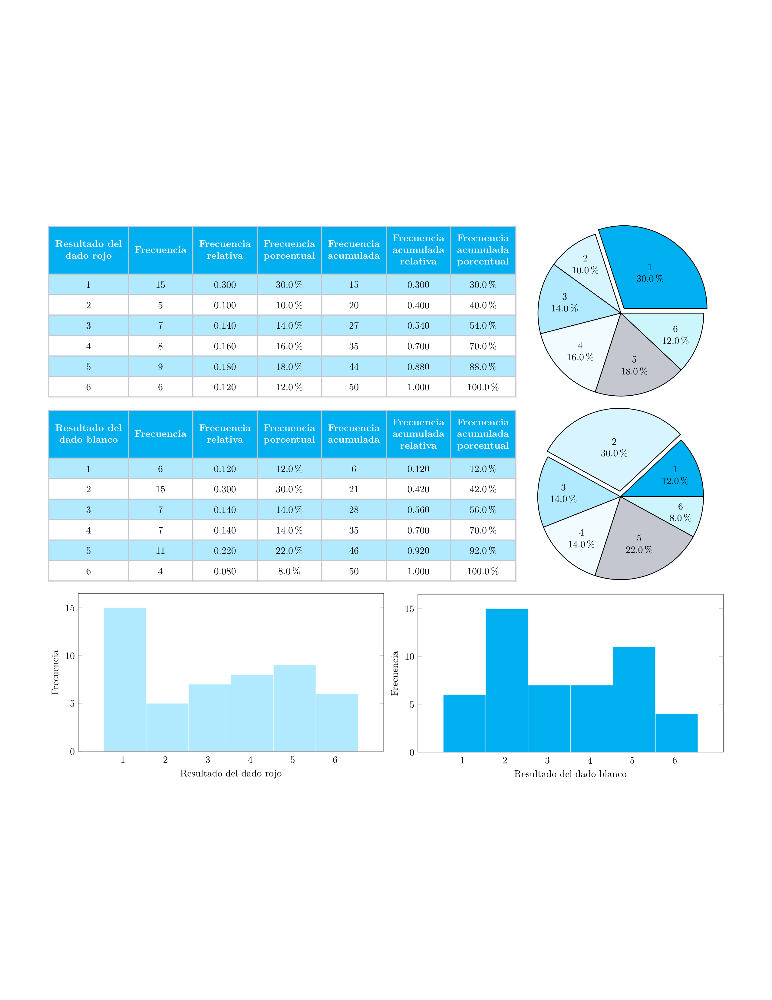

# Análisis de frecuencias de dados con LuaLaTeX

Este miniproyecto consiste en un documento en **LuaLaTeX** que muestra tablas de frecuencias, gráficas de pastel e histogramas a partir de un experimento: **lanzar 50 veces dos dados (uno rojo y uno blanco) y analizar los resultados**.

## Contenido del documento

El PDF generado contiene:

- **Tablas de frecuencias** (absoluta, relativa, porcentual, acumulada, acumulada relativa y acumulada porcentual)  
  para cada uno de los dados.

- **Gráficas de pastel** que ilustran la distribución porcentual de cada dado.

- **Histogramas** que representan la frecuencia absoluta de los resultados.

## Vista previa

